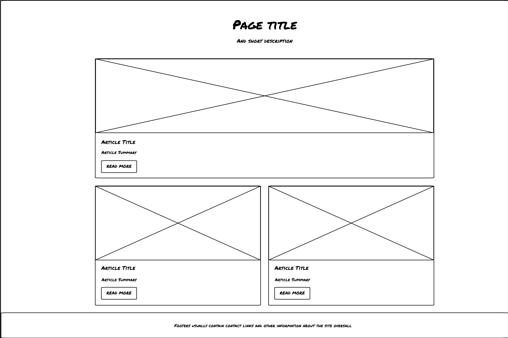

# Wireframe

## Learning Objectives

<!-->-->

- [ ] Use semantic HTML tags to structure the webpage
- [ ] Create three articles, each including an image, title, summary, and a link
- [ ] Check a webpage against a wireframe layout
- [ ] Test web code using [Lighthouse](https://programming.codeyourfuture.io/guides/testing/lighthouse)
- [ ] Use version control by committing often and pushing regularly to GitHub
- [ ] Develop the habit of writing clean, well-structured, and error-free code
<!-->-->

## Task

Using the provided wireframe and resources, write a new webpage explaining:

1. What is the purpose of a README file?
1. What is the purpose of a wireframe?
1. What is a branch in Git?

The page layout should closely match the wireframe. Exact replication is the goal, but small differences may be accepted.

There are some provided HTML and CSS files you can use to get started. You can use these files as a starting point or create your own files from scratch. You _must_ modify the HTML and CSS files to meet the acceptance criteria and you must check this criteria yourself before you submit your work.

## Acceptance Criteria

- [ ] Semantic HTML tags are used to structure the webpage.
- [ ] The page scores 100 for Accessibility in the Lighthouse audit.
- [ ] The webpage is styled using a linked .css file.
- [ ] The webpage is properly committed and pushed to a branch on GitHub.
- [ ] The articles section contains three distinct articles, each with its own unique image, title, summary, and link.
- [ ] The page footer is fixed to the bottom of the viewport.
- [ ] The page layout closely match the wireframe.

### Developers must adhere to professional standards.

> Before you say you're done: Is your code readable? Does it run correctly? Does it look professional?

These practices reflect the level of quality expected in professional work.
They ensure your code is reliable, maintainable, and presents a polished, credible experience to users.

- [ ] My HTML code has no errors or warnings when validated using https://validator.w3.org/
- [ ] My code is consistently formatted
- [ ] My page content is free of typos and grammatical mistakes
- [ ] I commit often and push regularly to GitHub

## Resources

- [Wireframe](https://www.productplan.com/glossary/wireframe/)
- [Semantic HTML](https://www.w3schools.com/html/html5_semantic_elements.asp)
- [:first-child](https://developer.mozilla.org/en-US/docs/Web/CSS/:first-child)
- [Format Code and Make Logical Commits in VS Code](../practical_guide.md)
